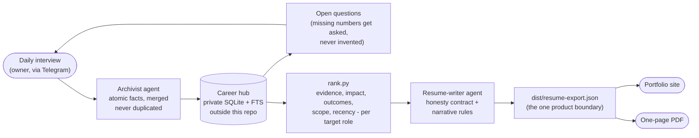

# career-engine

An agent-driven career memory that keeps your resume honest, current, and
everywhere at once.

- **Facts, not prose.** Everything you have done lives as structured fact rows
  (action, impact, metrics with provenance, tags, weights) in a local SQLite
  hub. An archivist agent ingests new material through periodic interviews.
- **Honesty contract.** Every claim on the resume must trace to a fact row.
  Numbers carry a basis (direct or estimated + how). Titles are your actual
  titles. Client names are anonymized at write time.
- **Ranking engine.** `bin/rank.py` scores every fact per target role
  (evidence, impact, distinctiveness, scope, recency) refined by pairwise
  LLM-judge Elo, and selects a one-page set deterministically.
- **A writing method, not a template.** The resume-writer agent composes each
  bullet with a 5-slot schema and an outcome ladder (adoption > trial > win >
  pipeline > technical result > built), enforced by lint rules.
- **One artifact out.** The engine's only output is `dist/resume-export.json`
  (schema: `contracts/resume-export.schema.json`). Consumers - a portfolio
  site, a PDF renderer, LinkedIn tooling - apply it however they like.

## Docs

- [How the ranking works](docs/ranking.md) - the five sub-scores, the outcome
  ladder, role profiles, selection, and Elo refinement
- [The writing method](docs/writing-method.md) - honesty contract, role
  narrative rules, bullet mechanics, and the owner taste loop

## Layout
    bin/        career.sh (hub CRUD + export), rank.py, rank_refine.py
    docs/       how the ranking and writing method work
    config/     roles.json - target-role scoring profiles
    contracts/  resume-export.schema.json - the product boundary
    .claude/    agent charters: archivist, resume-writer, ranking-judge
    dist/       generated exports (gitignored)

## Data
The hub database is NEVER stored in this repo. Set `CAREER_DATA_DIR` (default:
`../career-corpus`) to a private directory containing `career.db`.

## License

All rights reserved. Published as a portfolio showcase - read and learn from
it freely; contact the author for any other use. Not open source (yet).
